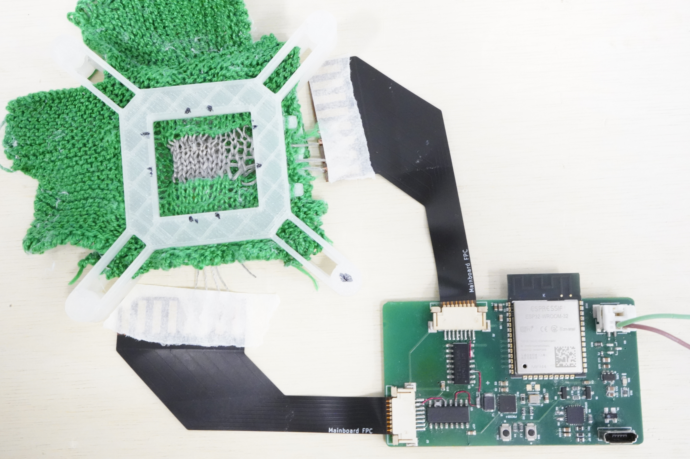
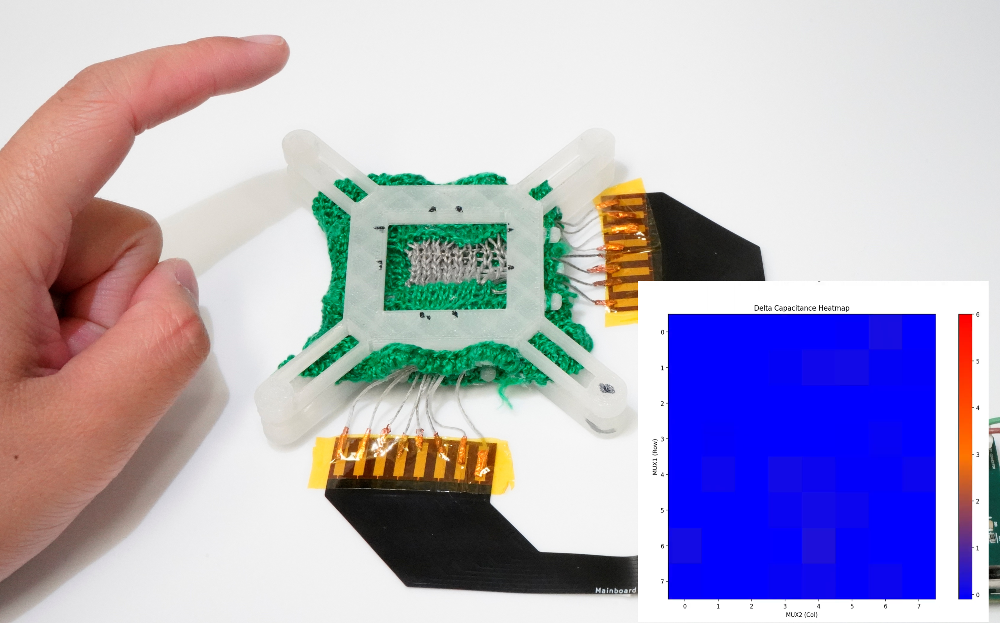
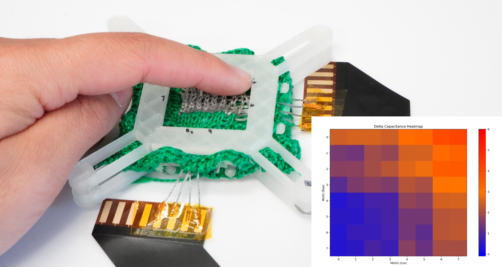

# VAK-Lab---TEMS-Project
Repository for my work contributing to the TEMS (Textile Electromechanical Sensing) project within the VAK lab at Northwestern University

In the spring of 2026, I contributed to the design of the first capacitive sensing PCB which utilized an LC tank to measure the capacitance of individual intersections between conductive yarns. An ESP32 controlled 2 8-1 analog multiplexers allowing sensing of up to an 8x8 grid. Using this board I performed various tests on patches made from our yarn to showcase its ability to be used as a sensor both through capacitance and the triboelectric nanogenerator effect. To do so, I 3D modeled and printed clamps to hold patches during stretching via an instron machine as well as a casing that made applying pressure to a consistent area with consistent tension possible. 

  
   
  <em>Custom PCB attached to patch held in 3D printed casing</em>

<table align="center">
  <tr>
    <td align="center">
       
      <em>Heat map with no pressure applied</em>
    </td>
    <td align="center">
       
      <em>Heat map with pressure applied to top right corner</em>
    </td>
  </tr>
</table>
